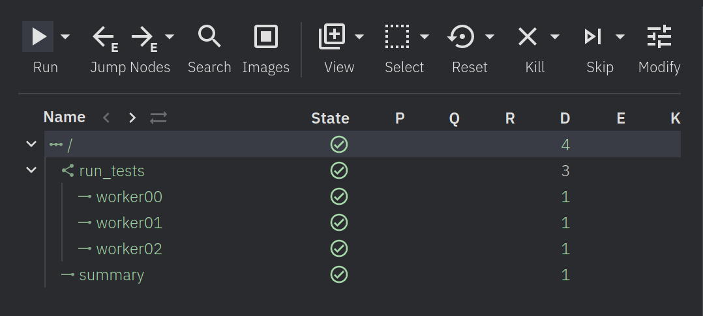
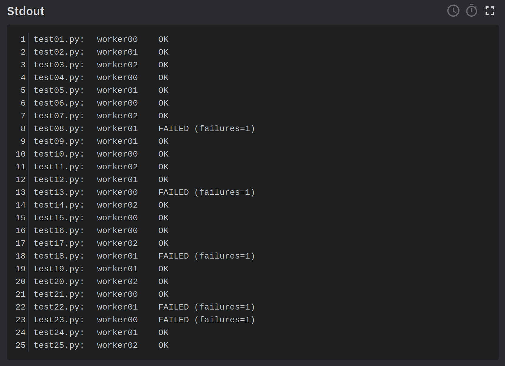
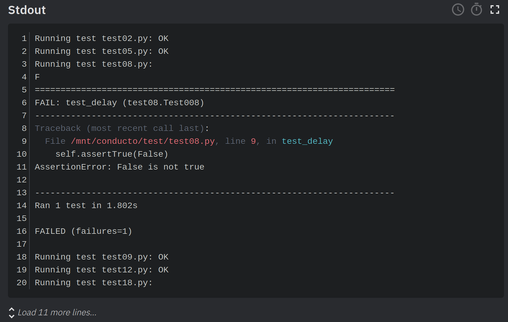

## Conducto Parallel Test Runner Pipeline

This is a demonstration of one way that Conducto can be used to run a suite of unit tests
in parallel with a fixed number of worker containers.

Tests are in the `test` directory. To simulate real python unit tests, these sleep for an amount
of time that's different for each test. Most of the tests pass, but there are a few that fail.
(If you want to tweak the tests, you can use `write_tests.py` in the same directory to generate
a set.)

The command to run this Conducto pipeline is

    python test_runner.py run_tests --local --run

Note that Conducto is Python 3, so the python executable name on your system may be `python3` instead
of `python` (as it is on my Debian Linux system), or something else.

When the run is completed, you should have a pipeline that looks like this:

The root node (which is serial) first starts the run_tests node, which spawns 3 workers that run tests
in parallel. Once the tests are done, the summary node runs and collects a summary of the tests run.

Clicking on the summary node and scrolling down to the `Stdout` window, you should see something like
this:

This shows which worker ran each test. To get more detail about a failed test, go to the worker node
and look at its `Stdout`. From the summary above, we see that failing test `test08.py` ran on node
worker01. Clicking on worker01 in our pipeline and looking at the `Stdout` window shows us

Here we have the complete output of the failing test.

## How it works

This pipeline uses Conducto's `temp_data` store to coordinate the test runs between the worker nodes.
Each worker reads through a list of tests, and for each test checks the `temp_data` store to see whether
another node is running it. If not, it writes to the `temp_data` store itself and runs the test. After
the test is run, the worker writes its own name and the test results to the `temp_data` store, where they
are later processed by the summary node.

There is a slight chance of a race condition with this method, which would lead to two worker nodes running
the same test. While undesireable, this only means that the test suite will run a bit longer. Perhaps in
the future, Conducto will have a queuing mechanism to prevent this.
